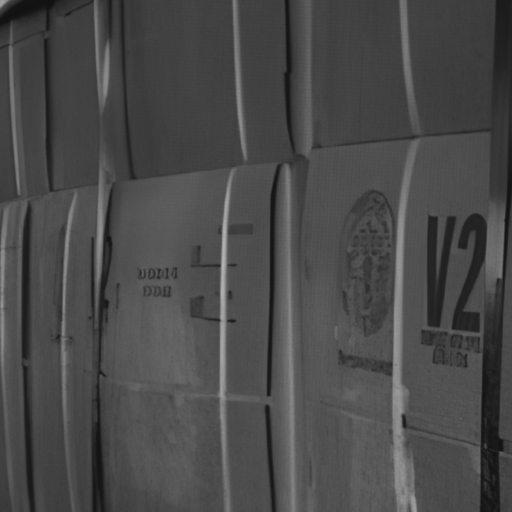

# [CVPR 2026] High-Quality and Efficient Turbulence Mitigation with Events
⭐ This repository will contain the official implementation and dataset for our project.
⭐ The code and dataset will be released soon.

---

## 📌 Overview

We present **CTTH and LATH**, **two event–frame paired datasets** for turbulence imaging research, covering both **thermal** and **atmospheric** cases.

### 🔥 CTTH: Close-range Thermal Turbulence Hybrid Dataset

<table align="center">
  <tr>
    <th>GT</th>
    <th>Turbulent Video</th>
    <th>Events</th>
    <th>GT</th>
    <th>Turbulent Video</th>
    <th>Events</th>
  </tr>
  <tr>
    <td></td>
    <td></td>
    <td></td>
    <td></td>
    <td></td>
    <td></td>
  </tr>
  <tr>
    <td></td>
    <td></td>
    <td></td>
    <td></td>
    <td></td>
    <td></td>
  </tr>
</table>

  <em>Each group shows ground truth, turbulent observation, and corresponding events.</em>

The CTTH dataset is designed to capture:

- 🚗 Dynamic object
- 🏙️ Static background structures
- 🎯 Corresponding ground-truth references

This enables rigorous evaluation of turbulence mitigation under **real static and dynamic-object scenes**.

---

### 🌫️ LATH: Long-range Atmospheric Turbulence Hybrid Dataset

The LATH dataset captures turbulence effects across **various imaging distances and scenes**, including:

- 🌉 Long-range imaging
- 🏞️ Diverse environmental structures

This provides a valuable benchmark for evaluating **generalization under real-world atmospheric turbulence**.

---

This dataset is designed to support:
- **Turbulence mitigation**
- **Event-based video/image restoration**
---

## 🎬 Visual Examples

### 🔹 Turbulence Effects

  
  

### 🔹 Event Visualization

  

> 📎 More videos available in [videos/](videos/)

---

## 📦 Dataset Structure
